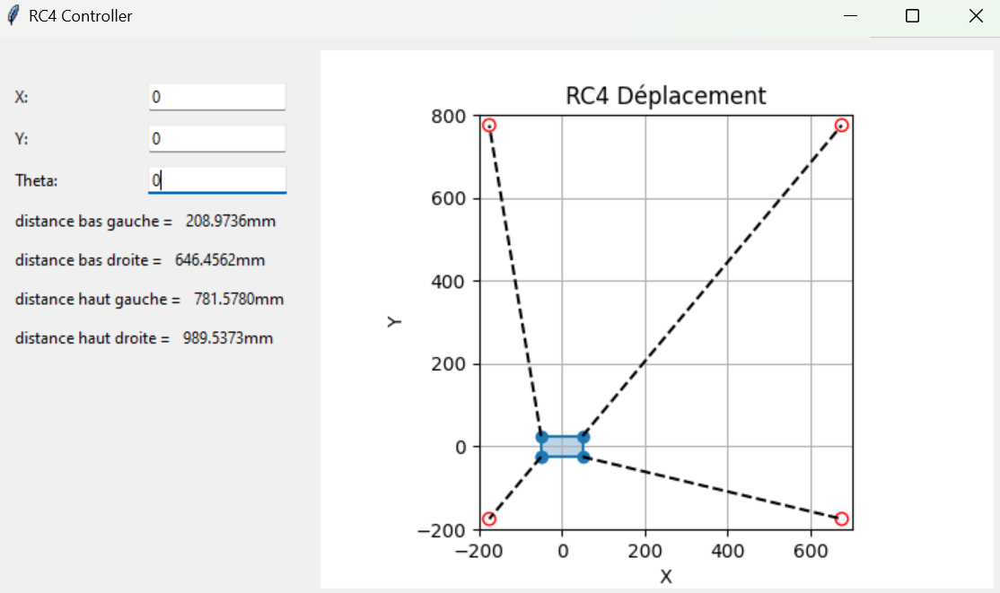
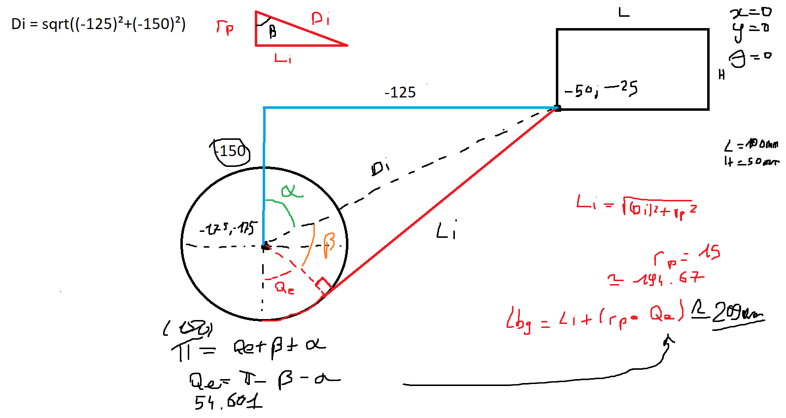

# RC4-Python
thomasclara@inria.fr (mail de contact du professeur)

Projet réalisé pour le cours de robotique à câbles | Mastère RISE
___
## Utilisation

Il suffit d'exécuter le script main.py pour lancer l'interface graphique.

Tant que les 3 valeurs (x,y,theta) ne sont pas rentrées, le mobile sera positionner au centre de son espace de travail avec un angle de 0°.
___
## Description

Le projet RC4 est une simple interface graphique permettant de rentrer les coordonnées ainsi que la rotation du centre du mobile, afin d'obtenir les longueurs en mm des câbles.

Un graphique accompagne le tout, celui-ci étant grandement simplifié pour des raisons de lisibilité.

___
## Calcul

Voici un extrait des calculs fait pour obtenir les longueurs des câbles (dans ce cas-ci, pour le câble BG) en 0,0,0 :
